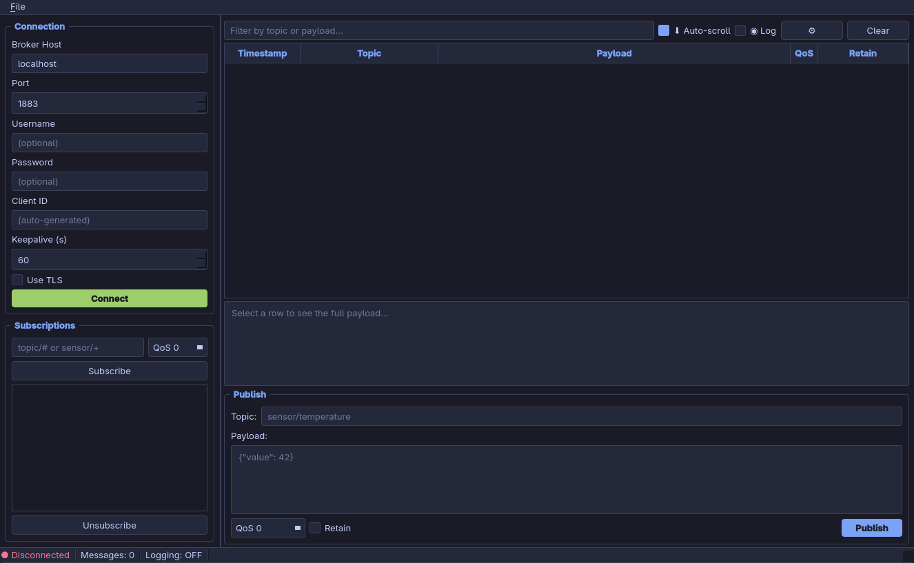

# MQTT Monitor

A lightweight desktop GUI for monitoring and debugging MQTT brokers, built with Python and PyQt6.

[](version.py)
[](https://www.python.org/)
[](https://www.riverbankcomputing.com/software/pyqt/)
[](https://eclipse.dev/paho/index.php?page=clients/python/index.php)
[](https://mqtt.org/)
[](LICENSE)



## Features

- Connect to any MQTT broker with optional TLS, username/password, and custom client ID
- Subscribe to multiple topics using wildcards (`#`, `+`)
- **Publishers panel** — lists every unique topic that has sent a message, colour-coded with a live message count; click any publisher to filter the table to that topic instantly
- Live message table with timestamp, topic, payload, QoS, and retain flag
- Real-time filter across topic and payload (stacks with the publisher filter)
- Detail panel with automatic JSON pretty-printing
- Publish messages with configurable QoS and retain flag
- Session logging to timestamped text files
- Export visible messages to CSV (`Ctrl+E`)
- **About dialog** — shows version, author, licence, and live dependency versions
- Tokyo Night dark theme
- Window layout and connection settings persisted across sessions

## Technologies

| Technology | Purpose |
|---|---|
| [Python 3.10+](https://www.python.org/) | Runtime |
| [PyQt6](https://www.riverbankcomputing.com/software/pyqt/) | GUI framework (Qt6 bindings) |
| [Qt6](https://www.qt.io/) | Underlying UI toolkit |
| [paho-mqtt](https://eclipse.dev/paho/index.php?page=clients/python/index.php) | MQTT client library (paho v1 & v2 API) |
| [MQTT protocol](https://mqtt.org/) | Lightweight publish/subscribe messaging |

## Project Structure

```
mqtt-qt-gui/
├── main.py           # Entry point, QApplication, Tokyo Night stylesheet
├── main_window.py    # QMainWindow, all UI panels, menus, and dialogs
├── models.py         # MessageTableModel (QAbstractTableModel), filter logic
├── mqtt_client.py    # MqttClient (QObject) wrapping paho-mqtt, Qt signal bridge
├── storage.py        # FileLogger for session-based message logging
├── version.py        # App version, author, and licence metadata
└── requirements.txt
```

## Installation

```bash
# Clone the repository
git clone https://github.com/your-username/mqtt-qt-gui.git
cd mqtt-qt-gui

# Install dependencies
pip install -r requirements.txt

# Run
python main.py
```

> Requires Python 3.10 or later. A virtual environment is recommended:
> ```bash
> python -m venv .venv
> source .venv/bin/activate   # Windows: .venv\Scripts\activate
> pip install -r requirements.txt
> ```

## Usage Guide

### Connecting to a broker

1. Fill in the **Broker Host** and **Port** fields in the left panel (defaults: `localhost`, `1883`).
2. Optionally set **Username**, **Password**, **Client ID**, and **Keepalive**.
3. Enable **Use TLS** if your broker requires an encrypted connection.
4. Click **Connect** (turns green when connected, red to disconnect).

### Subscribing to topics

1. Type a topic pattern in the **Subscriptions** input field.
   - `#` matches everything
   - `sensors/#` matches all topics under `sensors/`
   - `sensors/+/temperature` matches a single level with `+`
2. Select the desired **QoS** level (0, 1, or 2).
3. Click **Subscribe** or press `Enter`.
4. To remove a subscription, select it in the list and click **Unsubscribe**.

### Reading messages

Incoming messages appear in the table with five columns:

| Column | Description |
|---|---|
| Timestamp | Time the message was received (HH:MM:SS.mmm) |
| Topic | Full topic path, colour-coded per unique topic |
| Payload | Message content (truncated in the table) |
| QoS | Quality of Service level |
| Retain | Whether the broker is retaining this message |

Click any row to see the **full payload** in the detail panel below the table. JSON payloads are automatically pretty-printed.

**Right-click** a row for quick actions:
- Copy Topic
- Copy Payload
- Copy Full Row
- Publish to this Topic (pre-fills the publish form)

### Publishers panel

The **Publishers** group in the left panel automatically tracks every unique topic that has delivered at least one message. Each entry is colour-coded to match its topic in the message table and shows a live message count.

- **Click a publisher** to restrict the message table to that topic only.
- **Show All** clears the publisher filter and restores the full view.
- The publisher filter and the text filter bar work independently and stack together.
- Counts are kept accurate as old messages are evicted once the 2 000-message limit is reached.

### Filtering messages

Type in the **Filter** bar above the table to narrow results by topic or payload content. The status bar shows `visible/total` counts when a filter is active. Click the **×** button or clear the field to remove the filter.

A publisher-panel selection and the text filter can both be active at the same time — only messages that satisfy both are shown.

### Publishing messages

1. Enter a **Topic** in the Publish panel at the bottom.
2. Type the **Payload** (plain text or JSON).
3. Choose **QoS** and optionally enable **Retain**.
4. Click **Publish** or press `Ctrl+Enter`.

### Logging to file

- Check **Log** in the toolbar to start writing all received messages to a file.
- By default, a new timestamped file (`mqtt_YYYYMMDD_HHMMSS.txt`) is created in the `logs/` directory each session.
- Click **⚙** next to the Log checkbox to change the log directory or set a fixed filename.
- The current log file path is shown in the status bar.

### Exporting to CSV

Go to **File → Export to CSV…** (`Ctrl+E`) to save the currently visible messages (respecting any active filter) as a CSV file.

### Keyboard shortcuts

| Shortcut | Action |
|---|---|
| `Ctrl+Enter` | Publish message |
| `Ctrl+L` | Clear message table |
| `Ctrl+E` | Export to CSV |
| `Ctrl+Q` | Quit |

### About

Go to **About → About MQTT Monitor…** to view the application version, author, licence, and the exact installed versions of all runtime dependencies.

## Author

**Zissis Papadopoulos**

## License

This project is licensed under the [MIT License](LICENSE).
